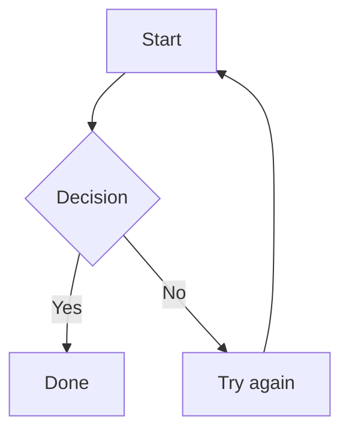

# Markdown to Word

A lightweight, single-file web app for converting Markdown into Word-friendly rich text.

Paste Markdown on the left, preview formatted output on the right, then copy everything with formatting and paste directly into Microsoft Word, Google Docs, or other rich-text editors.

## Features

- Live Markdown preview
- Rich text copy (`Copy all`) for Word-ready pasting
- Mermaid diagram rendering (`mermaid` code blocks)
- Copy Mermaid diagrams as images
- Clean split-pane UI (desktop + mobile responsive)
- Dark mode support via `prefers-color-scheme`

## Supported Markdown

- Headings (`#` to `####`)
- Paragraphs
- Bold / italic / strikethrough
- Ordered and unordered lists
- Blockquotes
- Inline code and fenced code blocks
- Horizontal rules
- Links
- Tables
- Mermaid diagrams

## File Structure

- `markdown-to-word.html` — full application (HTML, CSS, JS)
- `README.md` — project documentation

## Usage

1. Open `markdown-to-word.html` in your browser.
2. Paste Markdown into the left panel.
3. Confirm formatting in the right panel.
4. Click `Copy all`.
5. Paste into Word (or another rich-text editor).

For Mermaid blocks, use fenced code with `mermaid`:

```markdown

```

## Notes

- Mermaid is loaded from jsDelivr CDN (`mermaid@10`).
- Internet access is required for Mermaid rendering unless you bundle Mermaid locally.
- The app is static and requires no build step or backend.

## License

No license file is currently included. Add one if you plan to distribute this project.
