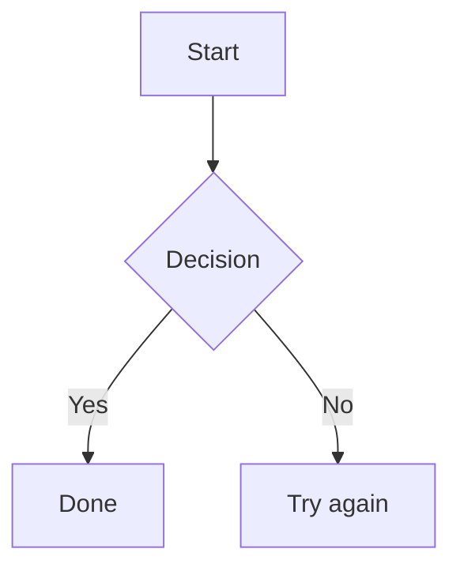

# Markdown to Word

Single-file local web app that converts Markdown into Word-friendly rich text.

Paste Markdown on the left, preview on the right, then either copy rich text or download a `.docx` file.

## What improved

- Real Markdown parser (`marked`) instead of fragile regex parsing.
- HTML sanitization (`DOMPurify`) for safer output.
- Web Worker parsing so large docs do not block the UI.
- Mermaid improvements:
  - Retry broken diagrams
  - Copy diagram as PNG
  - Export diagram as SVG
  - Copy diagrams in bulk
- Direct `.docx` export using `docx`.
- Local-first trust message in UI.
- Lightweight regression tests (`tests.html`).

## Features

- Live Markdown preview
- Rich text copy (`Copy all`) for Word-ready pasting
- `.docx` download (`Download .docx`)
- Mermaid rendering in fenced `mermaid` blocks
- Mermaid PNG copy, SVG export, and retry
- Responsive split-pane layout
- Dark mode support via `prefers-color-scheme`

## Do I need to install libraries?

No install required if you run this as an HTML file in a browser with internet access.

Libraries are loaded from CDNs:

- `marked` for Markdown parsing
- `DOMPurify` for sanitization
- `mermaid` for diagrams
- `docx` for `.docx` generation

If you want full offline usage, you can download and bundle those scripts locally later.

## Files

- `markdown-to-word.html` - full app (HTML/CSS/JS)
- `README.md` - documentation
- `tests.html` - lightweight regression test page

## Usage

1. Open `markdown-to-word.html` in your browser.
2. Paste Markdown into the left panel.
3. Confirm the formatted output.
4. Click `Copy all` or `Download .docx`.

For Mermaid blocks:

```markdown

```

## Test quickly

1. Open `tests.html` in your browser.
2. Confirm all tests pass.

## Notes

- This app is local-first and has no backend.
- Mermaid and other libraries are CDN-based by default.
- Add a license file if you plan to distribute this publicly.
